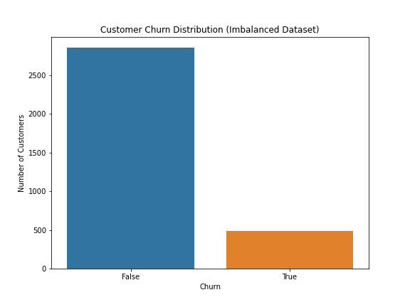
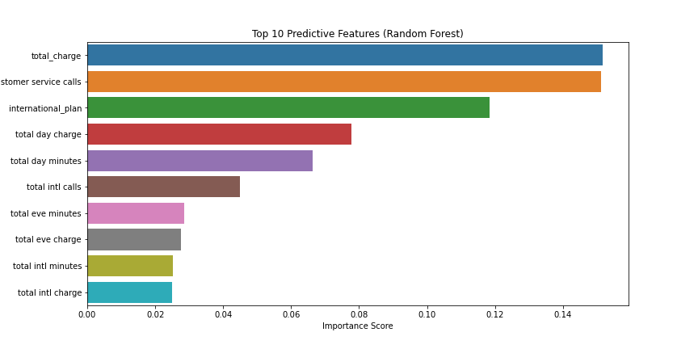

# Customer Churn Prediction - SyriaTel

  

## Overview

This project aims to predict customer churn for SyriaTel, a telecommunications company, using machine learning techniques. By identifying customers likely to leave, the company can take proactive measures to retain them, reducing revenue loss and improving customer lifetime value.

---

## Business and Data Understanding

### Business Problem

SyriaTel faces significant revenue loss due to customer churn. Retaining existing customers is more cost-effective than acquiring new ones. The goal is to build a predictive model that identifies at-risk customers based on their service usage and account characteristics.

### Stakeholder Audience

- **Business Managers:** Need actionable insights to design retention strategies.
- **Customer Service Teams:** Require lists of high-risk customers for targeted outreach.
- **Data Science Team:** Interested in model performance and feature importance for further improvements.

### Dataset Choice

The dataset, sourced from [Kaggle](https://www.kaggle.com/datasets/becksddf/churn-in-telecoms-dataset), contains 3,333 customer records with 20 features, including account information, usage metrics, customer service interactions, and demographics. The target variable is `churn` (True/False).

---

## Modeling

Two models were compared:

- **Logistic Regression:** A linear, interpretable model suitable for baseline performance.
- **Random Forest:** An ensemble model that handles non-linear relationships and class imbalance effectively.

The modeling workflow included:

- **Feature Engineering:** Created a `total_charge` feature, dropped non-predictive columns, and grouped rare states to prevent overfitting.
- **Preprocessing:** Used a `ColumnTransformer` to encode categorical features and scale numerical features.
- **Handling Class Imbalance:** Applied SMOTE to balance the training data (50% churned, 50% not churned).
- **Model Selection:** Compared Logistic Regression (linear, interpretable) and Random Forest (ensemble, handles non-linearity).
- **Hyperparameter Tuning:** Used grid search to optimize Random Forest for recall.

---

## Evaluation

Models were evaluated using:
- **Classification Report:** Precision, recall, and F1-score for both churned and non-churned classes.
- **Confusion Matrix:** Visual summary of prediction errors.
- **ROC Curve and AUC:** Assessed the ability to distinguish between classes.

**Results:**
- **Logistic Regression:** Good at predicting non-churned customers but struggled with churn detection (lower recall and precision for churn).
- **Random Forest:** Achieved higher precision, recall, and ROC-AUC, especially for the churn class, making it more reliable for business use.

---

## Feature Importance

- Top features: `total_charge`, `customer_service_calls`, `international_plan`.
- Insights used to guide business recommendations.

---

## Conclusion

- **Random Forest** is the recommended model due to its superior performance, especially in handling class imbalance and identifying churned customers.
- **Key business insights from feature importance:**
  - Customers with international plans and high daytime usage are at greater risk of churn.
  - Frequent customer service calls are a strong churn indicator.
- **Actionable Recommendations:**
  - Improve international plan offerings.
  - Monitor and support high-usage customers.
  - Enhance customer service to address issues promptly.

**For details and code, see [Customer-Churn-Prediction.ipynb](Customer-Churn-Prediction.ipynb).**
